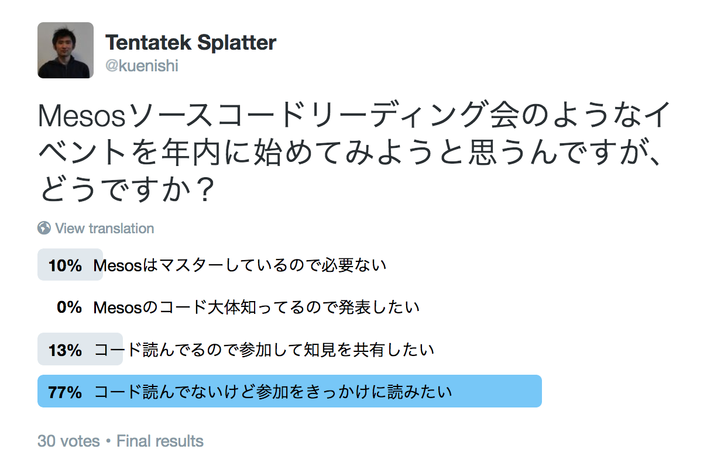
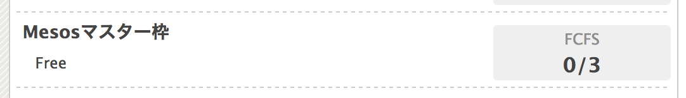
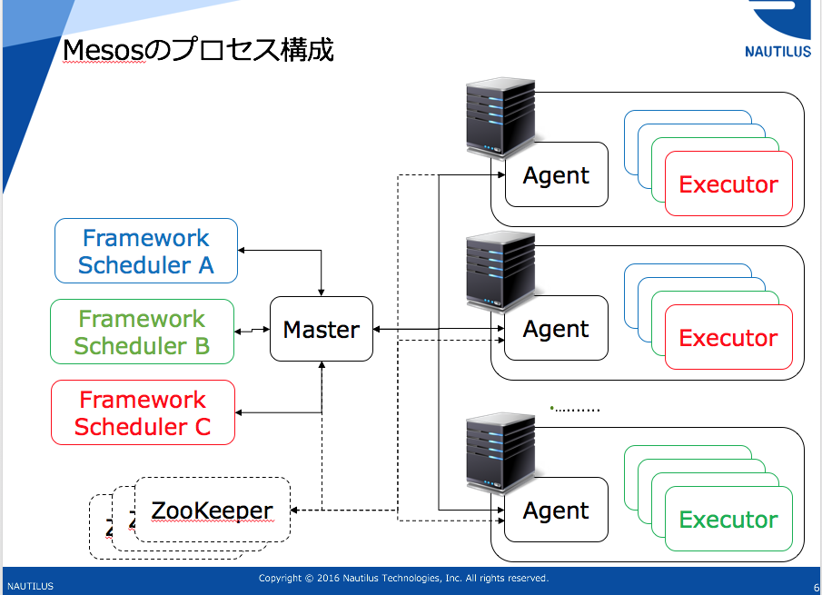
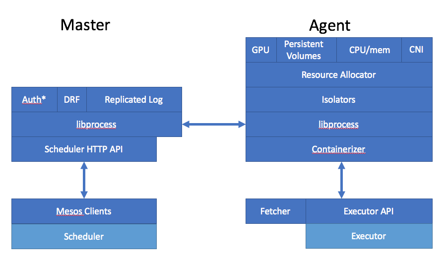
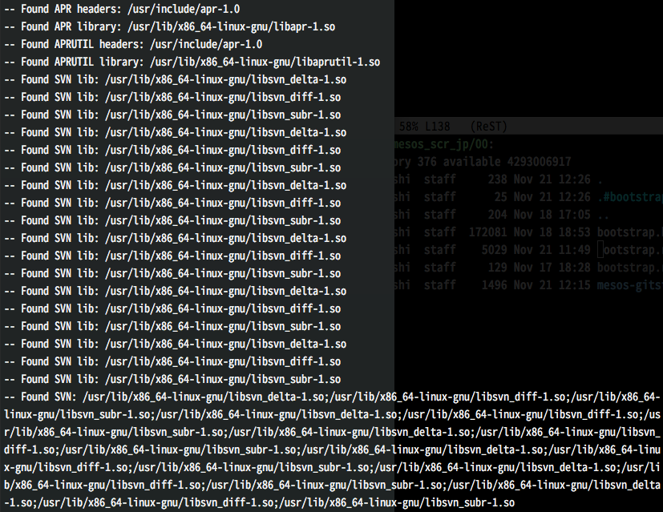

Mesos Source Code Reading
=========================

2016/11/21 @さくらインターネットさま

ノーチラス・テクノロジーズ　上西

はい
======

始まって
=========

しまいました
=================

Mesos
=====

コードリーディング
========================

きっかけ
==========

https://twitter.com/kuenishi/status/791492253206192128

Mesosマスターさん...
======================

https://mesos-scr-jp.connpass.com/event/43819/

この会の目的
================

* `Apache Mesos の公式ドキュメント <http://mesos.apache.org/documentation/latest/>`_ は、内容が充実しているとはいえ細かい挙動までは把握しにくい
* 参加者（私）が仕事を進めていく上で必要な雑多な知識をコードから拾っていく
* 一人で読むと心が折れやすい

進め方  
=======

* 発表者とそのテーマが決まると開催
* 基本的には会の終了時に次回の予定を決める
* 発表者と会場の予定を最優先（基本的に平日夜、 19:00 ~ 21:00 開催）
* 月に1~2度集まって、 2名ほどがMesosのソースコードを解説する

* (Optional) 発表者は、発表につかったテキストや資料 (のURL）を `このレ
  ポジトリ <https://github.com/kuenishi/mesos_scr_jp>`_ にコミット
* Open Questions は随時追加

全員自己紹介
================

* 氏名、 (Optional) 所属
* 技術的なバックグラウンド、または今取り組んでいること
* この会に参加する目的
* (Optional) Mesosに関する具体的な興味のあるところ
* (Optional) 運営に関する質問

とりあえず第0回ということで
=================================

* Mesosの 10,000 ft overview の説明
* よく分かってないところ

などをこれから話します  

Mesosのプロセス構成
===========================

Mesos の特徴
====================

* Two-level scheduler という仕組み

* 基本的なアイディアは、リソース管理とスケジューリングを分割
* リソース管理と簡単なタスク管理をMesosが担当
* スケジューリングは、個々 Scheduler Framework が与えられたリソースの範囲内でやりくりする
* 両者をつなぐのが `Scheduler API <http://mesos.apache.org/documentation/latest/scheduler-http-api/>`_ と Resource Offer
* ホワイトボードにResource Offerの絵をかく

~~
  
* 代表的な分散スケジューラーは、リソースをリクエストしてもらうという形式
* リソーススケジューリングがモノリシックになってしまい、柔軟性がない
* 目的に応じてリソーススケジューリングを使い分けにくい
* Fair-share/Capacity, Preemptive/Non-preemptive
  
Mesosの基本的な用語
=========================

* Master .. AgentとTaskを管理するノード
* Agent .. 実際にTaskを実行するノード
* Task .. Frameworkが実行したいプログラム
* Framework .. Mesosを使うユーザー側のアプリケーション（のようなもの）
* Scheduler .. Frameworkのうち、Taskを管理するユーザー側のプログラム
* Executor .. Agent上でプログラムを実行、管理するプログラム
* Fetcher .. Agent上でTask実行前にファイルをダウンロードするプログラム
* Containerizer .. Agent上でTaskを孤立化、実行するプログラム
  
Mesosの基本的な構成とモジュール(適当なスタック図)
===========================================================

先に読んでおきたい
====================

* libprocess
* 最小のフレームワーク: mesos-execute
* 全部のプロトコル: mesos.proto と通信まわりの実装
* Isolator 基本
* CommandInfo Executor
* Unified Containerizer 基本
* Fetcher (簡単に読めそう)

気になっているところ
========================

* Isolator 応用: linux/filesystem, docker/runtime, gpu/nvidia, cgroups/{cpu, mem, devices}
* Doninant Resource Fairness 論文とその実装
* Master - Agents間の障害検出
* 各クライアントの実装
* Boostrap, systemdまわり
* YARNとのAPI比較
  
コード以外なら…
===================

* Mesos論文は複数のバージョンが
* Authorのページより https://people.eecs.berkeley.edu/~alig/papers/mesos.pdf
* UCBのページより http://mesos.berkeley.edu/mesos_tech_report.pdf
* ACM Digital Library http://dl.acm.org/citation.cfm?id=1972488
* NSDI'11 Video https://www.usenix.org/conference/nsdi11/mesos-platform-fine-grained-resource-sharing-data-center

実際のコード
=================

Tag 1.1.0 / hash ``a44b077ea0df54b77f0`` ::

  $ git clone git://github.com/apache/mesos

* `GitStat result <./mesos-gitstat/index.html>`_
* 最初にどこからかインポートしてきている模様
* かなりActive
* Original paper の著者では、Benjamin HindmanとMatei Zahariaが入っているが、ほぼ全てBenjamin Hindmanによるコード
* Mesosphere のCo-Founder and Chief Architect

必要なライブラリ
===================

* libapr-1, libaprutil-1, subversion 関係

ビルドしてみる
===================

* CMakeでビルド::
   
  $ mkdir build
  $ cd build
  $ cmake ..
  $ make help

* テストしてみる (いろいろあるらしい)::

  $ make test
  $ make check
  $ sudo make distcheck

起動してみる
=================

Minimal な起動例 `w/GPU <https://github.com/apache/mesos/blob/master/docs/gpu-support.md>`_ ::

   $ mesos-master \
      --ip=127.0.0.1 \
      --work_dir=/var/lib/mesos

   $ mesos-agent \
      --master=127.0.0.1:5050 \
      --work_dir=/var/lib/mesos \
      --isolation="cgroups/devices,gpu/nvidia"

   $ mesos-execute \
      --master=127.0.0.1:5050 \
      --name=gpu-test \
      --command="nvidia-smi" \
      --framework_capabilities="GPU_RESOURCES" \
      --resources="gpus:1"

     
ディレクトリ構成
==================

* 3rdparty/include/src 以下はだいたい名前でわかるようになっている
* FreeBSD は automake
* MacOS, Linux, Windows は  CMake

~~
  
* ``3rdparty`` .. サードパーティのライブラリをtarごと突っ込んだディレクトリ
* ``cmake`` .. CMake のファイル群
* ``docs`` .. 公式サイトのドキュメントソース
* ``support`` .. 開発便利ツール系
* ``bin`` .. 起動スクリプト系
* ``mpi`` .. MPICH2 向けツール
* ``site`` .. 公式サイトのビルドツール
* ``bootstrap`` .. automake系コマンド
* ``CHANGELOG`` .. 真面目なChangeLog（リリースノート代わり）
* ``include`` .. C++ include files
* ``src`` .. C++/Python/Java のコード
* ``src/tests`` .. テストコード

3rdparty: サードパーティライブラリ
=======================================

全部がレポジトリに…

* `libprocess <https://people.eecs.berkeley.edu/~benh/libprocess/>`_
* elfio
* glog
* leveldb
* http-parser, nvml, picojson, pip, protobuf, wheel, setuptools, zookeeper  

include/mesos
================

``include/mesos/mesos.proto``

* ここに（ほぼ）全てのプロトコルが記述されている
* ヘンにドキュメントを見るよりも参考になる
* `I'm feeling lucky! <https://github.com/apache/mesos/blob/master/include/mesos/mesos.proto>`_  

Entrypoint
==========

``src/master/main.cpp``
と
``src/slave/main.cpp``

もういちど数えてみる::

  $ find include -type f |egrep "pp$" | xargs wc
  ...
     9381  40458 309004 total
  $ find src -type f |egrep "pp$" | xargs wc
  ...
   280792  802725 8464423 total
  $ find 3rdparty/ -type f | egrep "pp$" | xargs wc
  ...
    70783  226874 2020523 total
   

コミュニティ
===============

* http://mesos.apache.org/community/
* 活発なのはSlack ( mesos.slack.com ) とML
* 真面目なのはJIRA
* みんな割とフランク

Questions?
==========

* 次回はいつ開催？
* 多分libprocess?

Special Thanks and Resources
============================

This slide can be built by `rst2html5-tools <http://marianoguerra.github.io/rst2html5/>`_ with following options::

  rst2html5 --deck-js --pretty-print-code --embed-content bootstrap.rst

* `GitStats <http://gitstats.sourceforge.net/>`_

* `Mesos Frameworkの作り方 <https://speakerdeck.com/kuenishi/mesos-frameworkfalsezuo-rifang-how-to-make-mesos-framework>`_
* `分散スケジューラMesosの紹介 <https://speakerdeck.com/kuenishi/fen-san-sukeziyuramesosfalseshao-jie>`_
* `mesos, omega, borg: a survey <http://umbrant.com/blog/2015/mesos_omega_borg_survey.html>`_
* `Mesos: A Cloud Scheduler (1) <http://steps.dodgson.org/b/2013/03/10/mesos-a-cloud-scheduler/>`_ (2)は何処
